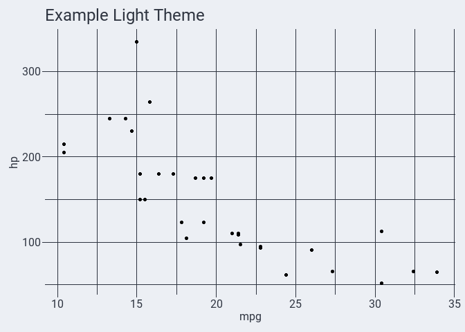
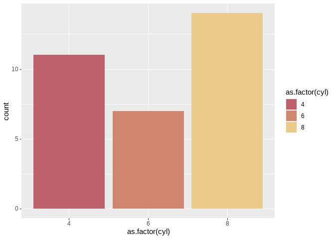
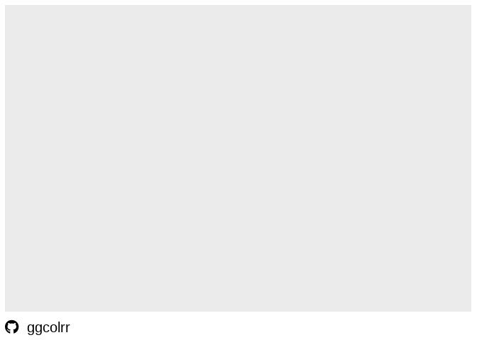

<!-- README.md is generated from README.Rmd. Please edit that file -->

# ggcolrr

<!-- badges: start -->

[](https://github.com/bradfordjohnson/ggcolrr/actions/workflows/R-CMD-check.yaml)
<!-- badges: end -->

The goal of ggcolrr is to add a collection of custom, reproducible
ggplot2 themes to your R toolbox.

## Installation

You can install the development version of ggcolrr from
[GitHub](https://github.com/) with:

``` r
# install.packages("devtools")
devtools::install_github("bradfordjohnson/ggcolrr")
```

## Example

This is a basic example which shows you how to solve a common problem:

``` r
library(tidyverse)
library(showtext)
library(ggcolrr)

mtcars %>%
  ggplot(aes(x=mpg,y=hp)) +
  geom_point(aes(color=factor(vs))) +
  labs(title="Example Light Theme") +
  theme_nord(light=TRUE,base_size=12) +
  scale_color_theme(theme = "nord_aurora")
```



``` r
mtcars %>%
  ggplot(aes(x=mpg,y=hp)) +
  geom_point(aes(color=factor(vs))) +
  labs(title="Example Dark Theme") +
  theme_nord(light=FALSE,base_size=12) +
  scale_color_theme(theme = "nord_aurora")
```


Built in color palettes can be used with the `scale_fill_theme` and
`scale_color_theme` functions:

``` r
library(ggplot2)
ggplot(mtcars, aes(x=as.factor(cyl), fill=as.factor(cyl) )) +
  geom_bar() +
  scale_fill_theme(theme = "nord_aurora")
```



Fonts Awesome Brand icons via the `create_brand_caption()` function:

``` r
ggplot() +
  create_brand_caption(caption_text = "ggcolrr") +
  theme(plot.caption = ggtext::element_textbox_simple(margin = margin(3,0,0,0,"mm"), size = 15))
```



## Aknowledgements

- Nord theme colors are based on the [Nord color
  palette](https://www.nordtheme.com/). The Nord theme was created by
  [Arctic Ice Studio](https://github.com/arcticicestudio)
- [Discord](https://discord.com/branding) theme colors
