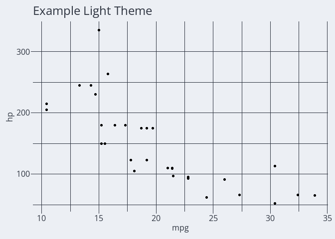
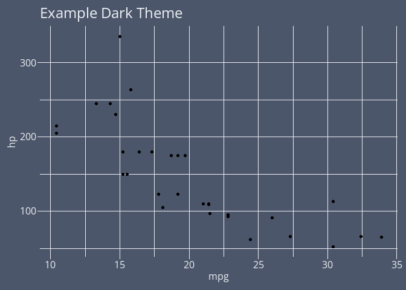

<!-- README.md is generated from README.Rmd. Please edit that file -->

# ggcolrr

<!-- badges: start -->

[](https://github.com/bradfordjohnson/ggcolrr/actions/workflows/R-CMD-check.yaml)
<!-- badges: end -->

The goal of ggcolrr is to add a collection of custom, reproducible
ggplot2 themes to your R toolbox.

## Installation

You can install the development version of ggcolrr from
[GitHub](https://github.com/) with:

``` r
# install.packages("devtools")
devtools::install_github("bradfordjohnson/ggcolrr")
```

## Example

This is a basic example which shows you how to solve a common problem:

``` r
library(tidyverse)
#> Warning: package 'tidyverse' was built under R version 4.2.3
#> Warning: package 'ggplot2' was built under R version 4.2.3
#> Warning: package 'tibble' was built under R version 4.2.3
#> Warning: package 'readr' was built under R version 4.2.3
#> Warning: package 'dplyr' was built under R version 4.2.3
#> Warning: package 'lubridate' was built under R version 4.2.3
#> ── Attaching core tidyverse packages ──────────────────────── tidyverse 2.0.0 ──
#> ✔ dplyr     1.1.2     ✔ readr     2.1.4
#> ✔ forcats   1.0.0     ✔ stringr   1.5.0
#> ✔ ggplot2   3.4.2     ✔ tibble    3.2.1
#> ✔ lubridate 1.9.2     ✔ tidyr     1.3.0
#> ✔ purrr     1.0.1     
#> ── Conflicts ────────────────────────────────────────── tidyverse_conflicts() ──
#> ✖ dplyr::filter() masks stats::filter()
#> ✖ dplyr::lag()    masks stats::lag()
#> ℹ Use the conflicted package (<http://conflicted.r-lib.org/>) to force all conflicts to become errors
```

``` r
library(showtext)
#> Warning: package 'showtext' was built under R version 4.2.3
#> Loading required package: sysfonts
#> Loading required package: showtextdb
```

``` r
library(ggcolrr)

mtcars %>%
  ggplot(aes(x=mpg,y=hp)) +
  geom_point() +
  labs(title="Example Light Theme") +
  theme_nord(light=TRUE,base_size=12)
```



``` r
mtcars %>%
  ggplot(aes(x=mpg,y=hp)) +
  geom_point() +
  labs(title="Example Dark Theme") +
  theme_nord(light=FALSE,base_size=12)
```


